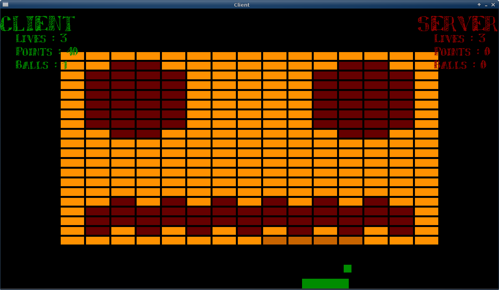

# DXBall

	A simple DX Ball clone using SDL 2

## About

DXBall is simplye a clone of the original DXBall. It's a hobby project that I've been working on from time to time since August 2013. My intention is to release it to Steam when I feel confident that it's working properly and that most ( if not all ) bugs have been taken care of. At the time of writing, there are very few known bugs and most of my time is spent cleaning up code and improve the internal workings of the game itself.

For instructions on how to run, scroll down to the Getting started part

### Features:
* [alpha] Visual configuration¹
* [alpha] Boards scaling to resolution
* [alpha] Multiplayer
* [alpha] Cross-platform²
* [beta] Bonuses
* [beta] Particle effects
* [beta] Game configuration

¹ All colors are configurable, font and particles are not configurable  
² I also intend to make it work on Android and Windows devices. OsX/iOS will also ( hopefully ) be supported one day

## Getting Started

### Linux

1. Clone this repository 'git clone https://github.com/olevegard/DXBall.git'
2. You will need SDL2.0, SDL2_image, SDL2_net and SDL2_ttf.
	* If on Linux, you might be able to install it like you install most other programs ( sudo apt-get install SDL2 )
	* Otherwise, you'll need to download the source code and compile it yourself
		* SDL2 : http://libsdl.org/download-2.0.php
		* SDL2_ttf : https://www.libsdl.org/projects/SDL_ttf/
		* SDL2_net : https://www.libsdl.org/projects/SDL_net/
		* SDL2_image : https://www.libsdl.org/projects/SDL_image/
3. Run './builDXB.sh' to build the project
	*	This will generate a makefile using qmake
	*	Then it will compiile using clang
4. Run './builDXB.sh' again with arguments to run the project
	* `-r` run the program using command line ards in buildDXB.sh
	* `-d` run the program with two cliens and server, making it possible to use multiplayer
	* `-D` run the aboce in GDB
	* `-g` run gdb also using the gdb and game args in buildDXB.sh
	* `-v` run valgrind using the valgrind and game ars stated in buildDXB.sh

Congratulations, against all odds DXBall is now running on your computer!

####  Warnings
The following warnings are not used

* `-Wno-c++98-compat` 			- C++98 compability is no concern for this project ( though I might add functionality to enable C++ 98 support later )
* `-Wno-c++98-compat-pedantic`	- C++98 compability is no concern for this project ( though I might add functionality to enable C++ 98 support later )
* `-Wno-switch-enum`				- This warning warns if you are not explicitly handling all possible enum values in a switch. SDL_Keycode contains more than 230 values.
* `-Wno-padded`					- Padding issues are not a concern at the moment.

All other warnings are handled and should be dealt with if possible

#### GCC vs Clang
Clang and GCC/G++ are similar in many ways. Most compiler flags used in clang do the same in gxx. However, gcc doesn't support the `Weverything` flag. This also means that the `-Wno-*****` will not work either. Other than this, gcc/g++ should work as well as clang. However; clang is recomended because of it's clearer errors and the `-Weverything` flag.

####Valgrind
Valgrind is run from the buldDXBall.sh file. It uses the following command.
	`valgrind --tool=memcheck --leak-check=full -suppressions=valgrind/ignore`

This will run valgrind and check the program for any leaks. There should be *none*.

If you remove the last command ( `suppression=valgrind/ignore` ) you will get all "errors" from SDL, which probably isn't important to this game.

## Windows
1. Clone this repository:
	*Using your git client, clone https://github.com/olevegard/DXBall.git.
	* Using terminal, simply run 'git clone https://github.com/olevegard/DXBall.git'
2. Install Visual Studio 2013 ( previous versions won't work because of C++11 functionality )
	* VS2013 can be found here : http://msdn.microsoft.com/nb-no/dn369242?bk_Seg=default
3. Download SDL2 development libraries ( not just runtime libraries! )
	* SDL2_ttf : https://www.libsdl.org/projects/SDL_ttf/
	* SDL2_net : https://www.libsdl.org/projects/SDL_net/
	* SDL2_image : https://www.libsdl.org/projects/SDL_image/
4. Start msproj/DXBall.sln
5. Set up the libraries and header files
	* Guide here : http://lazyfoo.net/SDL_tutorials/lesson01/windows/msvsnet2010e/index.php ( skip to step 3 )
6. Compile, run and have fun!

